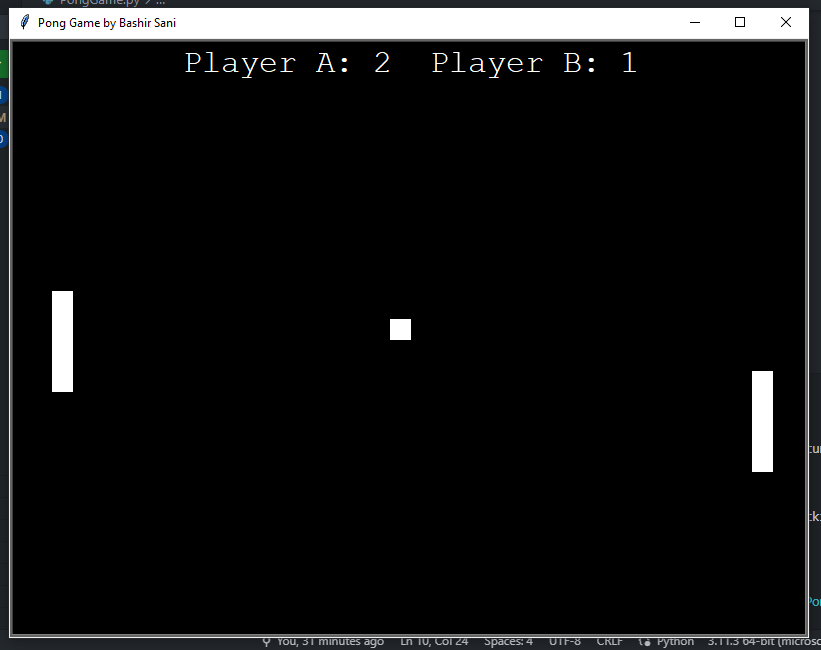

# Simple Pong Game in python For Beginners

This is a simple Pong game implemented in Python. It is a classic two-player game where each player controls a paddle to hit the ball and score points. 
The game includes features such as moving paddles, ball collision, and keeping score.

## Author
- Bashir Sani

## Game Structure
This game is Consist of several structures:
- Part 1: Creating the play Ground
- Part 2: Adding the two Paddles and Ball
- Part 3: Moving the Paddles
- Part 4: Moving the Ball
- Part 5: Colliding With the Paddles
- Part 6: Adding Scores
- Part 7: Adding Sounds

## Instructions
1. Use the "W" and "S" keys to control the left paddle (Player A).
2. Use the up and down arrow keys to control the right paddle (Player B).
3. The objective is to hit the ball with the paddles and prevent it from crossing your side of the play area.
4. Each time the ball crosses the opponent's side, a point is scored.

## Dependencies
The game uses the following libraries:
. turtle: A graphics library used for creating the game interface.
. winsound: A library used to play sound effects (Windows-only)

## How to Run
To run the game, make sure you have Python installed. Then, follow these steps:
1. Create a new Python file and copy the code into it.
2. Save the file with a .py extension, for example, pong_game.py.
3. Open a terminal or command prompt and navigate to the directory where the file is saved.
4. Run the following command to execute the game: python pong_game.py.
5. The game window should appear, and you can start playing.

Note: Make sure to download the required sound files (pong.wav and fail.wav) in the same directory as the Python file for the sound effects to work.

## License
this project is licensed under the [MIT License](LICENSE).

## Acknowledgments
- Thanks to [Python]((https://docs.python.org/3/library/turtle.html)https://docs.python.org/3/library/turtle.html](https://www.python.org/)) for their awesome libraries.

## Sample Solution

